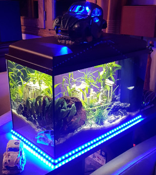
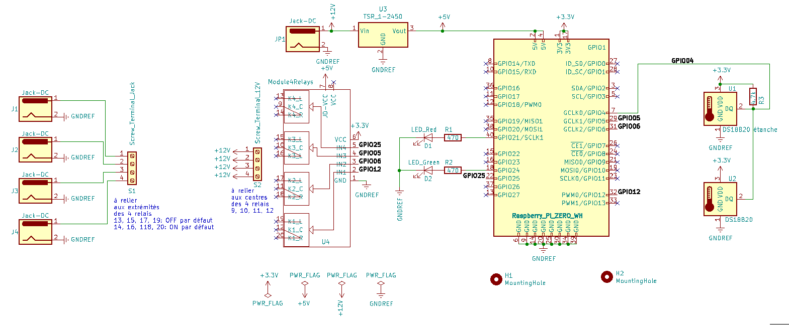
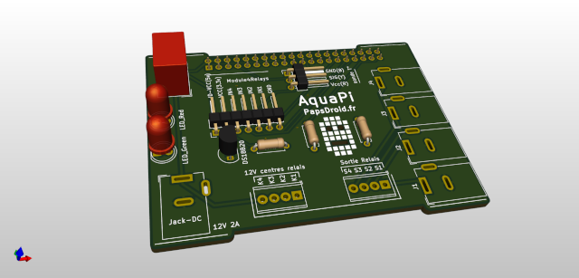
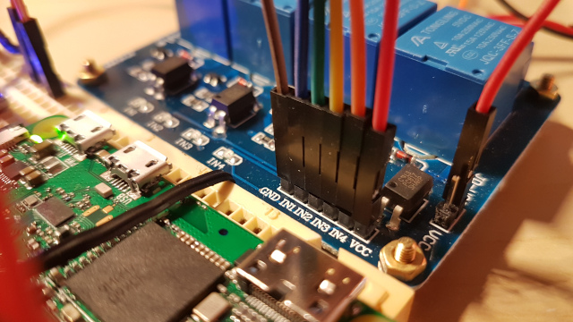
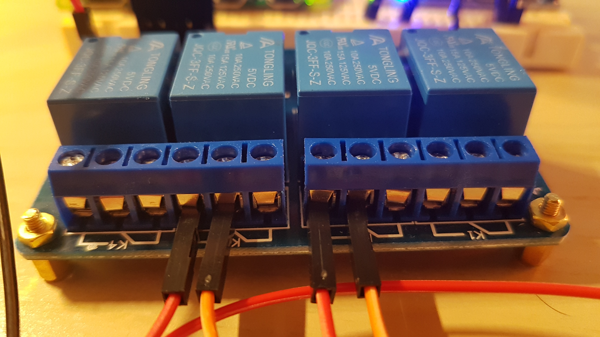
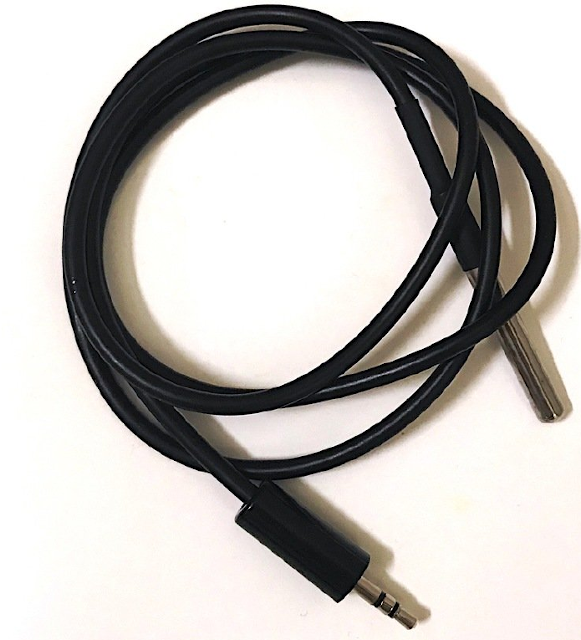

# aquaPi
DIY monitoring aquarium sur https://www.papsdroid.fr/blog/categories/aquapi

Monitoring d'aquarium à base d'un raspberry pi zéro qui héberge un serveur WEB consultable sur son smartphone, et qui pilote une carte de 4 relais 12v opto-couplés  afin de piloter les éclairages leds 12v et les éventuels moteurs 12v (distributeur de nouriture, pompe ...), ainsi que des capteurs (température de l'eau, température du boîtier de commande).

## Installation du serveur WEB sur Raspberry pi zéro

Il s'agit de la solution Reefpi d'Adafruit, j'ai rédigé [ce tutoriel](https://www.papsdroid.fr/post/aquapi-diy-monitoring-aquarium) complet pour procéder à l'installation du système.

## Carte électronique

Ce circuit électronique alimenté en 12v va permettre au Raspberry pi de piloter une carte de 4 relais 12v, de capter la température du bassin, la température du boîtier et d'activer l'éclaraige de deux leds témoins une verte (qui signifie que le serveur WEB est opérationnel) et une rouge (qui s'allume quand une alerte est détectée par le système Reefpi)

Le PCB est réalisable avec les fichiers GERBER zippés fournis dans le dossier GERBER.
La carte est conçue pour être exactement aux même dimension que la carte de 4 relais 12V afin de faciliter l'intégration dans un boîtier imprimé 3D fait sur mesure.

### Matériel nécessaire :

* Le circuit imprimé à faire imprimé chez n'importe quel fabriquant de PCB (double couche)
* 2 leds 5mm, 1 rouge et une verte
* résistances: 2 * 470Ω + 1 * 4.7kΩ
* 1 capteur de température DS18B20 non étanche (format TO90)
* 1 capteur de tempéraure DS18B20 étanche
* 1 barrette à souder  2*20 pins femelle pas 2,54mm
* 1 connecteurs pin header mâle coudé (horizontal) 2.54mm: 1x7 pins (prendre 1 de 4 pins + 1 de 3 pins à mettre côte à côte): pour relier la carte aux relais
* 1 connecteur pin header mâle coudé (horizontal) 2.45mm: 1x3 pins: pour relier à la sonde de température étanche.
* 2 borniers à vis à souder type phoenix 4 pins 2.54mm: ils servent à relier le PCB aux relais 12V.
* 5 jack DC 3 points (1 pour l'alimentation 12v, et 4 autres pour relier les appareils 12v aux 4 relais)
* 1 jack Audio mâle 3.5mm stéréo (il doit y avoir 2 colerettes noires) à soudier: on va y souder les 3 fils de la sonde de température étanche.
* 1 jack audio femelle 3.5mm stéréo, montage en surface, avec un écrou de fixation.
* 1 convertisseur DC/DC 12v->5v référence TSR 1-2450. Attention à **ne pas prendre un LM7805** qui est un convertisseur linéaire avec un très mauvais rendement (40%) et qui chauffe énormément. Le TSR 1 est un convertisseur DC/DC à plage bien plus performant avec un **rendement de 94%**: aucun problème de chauffe ni de gaspillage électrique donc.
* 1 barette femelle 2*20 pin, sur lequel sera branché le raspberry pi.
* 1 alimentation 12V CC, 2A (24W) suffisent si vous n'avez pas des km de leds à allumer, sinon prenez plus puissant.
* 10 câbles souples dupond femelle/femelle pour relier les pin headers coudés à la carte relais (7 câbles) et jack de la sonde de température étanche (3 câbles).
* 8 câbles monobrun pour relier les sorties relais de la carte aux relais 12v.

La soudure des composants sur la carte est très simple il suffit de se laisser guider par la sérigraphie. Seul le connecteur 2*20pin du Rapsberry se positionne sous la carte, tous les autres éléments sont au dessus.

### relier le PCB et la carte Relais
il faut utiliser des connecteurs souples dupond femelle/femelle et relier les deux cartes en suivant [ce guide](https://www.papsdroid.fr/post/aquapi-diy-monitoring-aquarium-alimentations) et plus particulièrement la section "Commande 12V pilotées par le Raspberry pi". La première section du guide concerne une alimentation du système "ancienne version" et non compatible avec le boîtier imprimé 3D qui sera proposé par la suite.

Chaque relais est à voir comme **un interrupteur 3 points** commandé par le raspberry pi. Il distribue le 12V du milieu soit à doite (au repos) soit à gauche en faisant un "clac" caractéristique quand il est activé. Selon le fonctionnement que l'on souhaite (12v au repos ou bien 12v activé) il faut brancher le fil "Rx" de la carte au sur la vis gauche ou droite du relais "x", la vis du milieu étant elle toujours à 12Vcc.

## Capteurs

Il y a déjà un capteur de température DS18B20 soudé sur la carte, et un autre étanche va pouvoir être plongé dans l'aquarium et être relié à la carte via une prise Jack Audio 3 fils. La partie femelle sera vissée sur le boitier imprimé 3D et des fils soudés seront à relier au bornier 3 vis de la carte (en haut à gauche au dessus des 4 prises Jacks DC reliées aux relais.)

Les explications et paramétrage du système pour tenir compte des capteurs sont expliqués dans [ce guide](https://www.papsdroid.fr/post/aquapi-diy-monitoring-aquarium-les-capteurs)

## Boîtier imprimé 3D

Boîtier en 3 parties: 
* partie basse avec des ornières pour y loger l'une sur l'autre la carte relais et la carte avec le Raspberry pi, 
* partie haute pour faire couvercle
* réhausse pour souder les 2 Leds à la bonne hauteur

**EN COURS DE CONCEPTION**

--> à suivre

